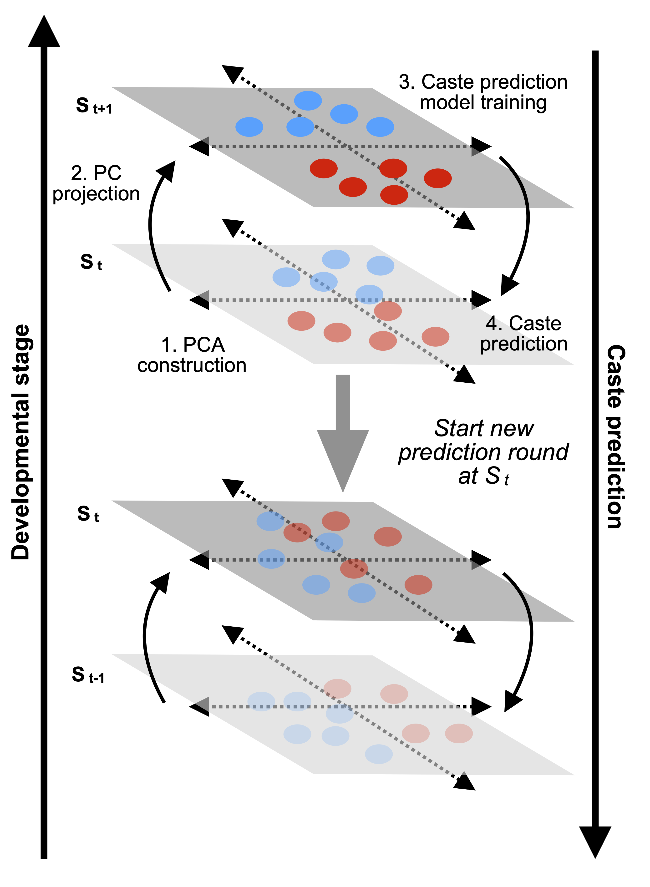

  

The backward progressive algorithm (BPA) predicts caste identities in previous developmental stages, using non-validated transcriptomes at the target stage (St) to construct PCAs and then projects these onto the subsequent stage (St+1) where caste identities are known. The BPA then uses the known caste labels at St+1 to identify PCs that are associated with confirmed caste identity and uses linear discriminant analysis to train a predictive model, assuming that the PCs at St+1 are also associated with caste identities at St as expected from developmental continuity. The trained model then predicts caste identities at St, after which it assumes these predicted caste identities to be real and initiates a next round to predict caste identities at stage St-1. This process continues until the prediction likelihoods at St-n become too low to be informative. 
