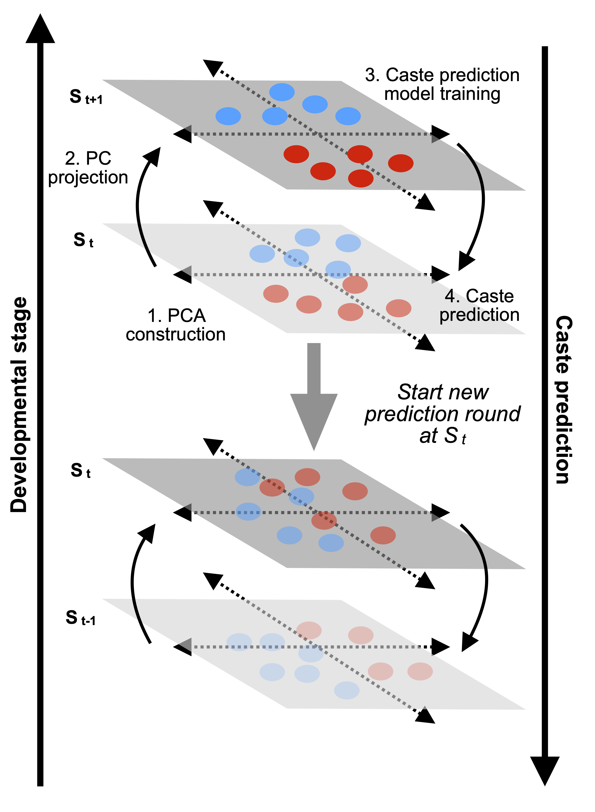

  

Schematic diagram for measurement of developmental potential across adjacent stages based on transcriptomic distance. For each sample in stage t (St), its transcriptomic distance to an average gyne sample and an average worker sample in stage t+1 (St+1) can be described as the addiction products of caste related distance and development related distance, where the latter are the same either to gyne or to worker and thus can be cancelled out. Therefore, developmental potential can be measured as the ratio of the caste related distance difference to the distance between gyne and worker. This ratio ranges from -1 (identical to worker in St+1) to +1 (identical to gyne in St+1). The developmental distance can then be measured as the sum of distances to gyne and worker minus the distance between gyne and worker. The transcriptomic distance here is measured with Euclidean distance using all genes.
